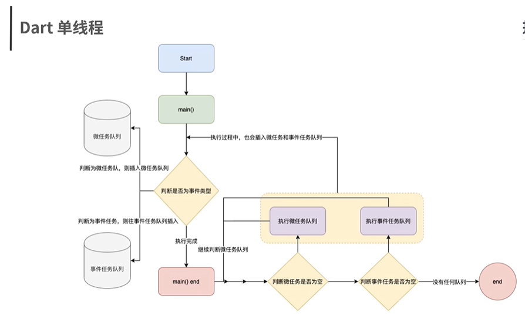

# dart 语言和 js 的区别

## 一、语言基础语法

- Symbol 在 dart 中是反射的概念，在 js 中是唯一标识符的概念

```dart
void main() {
    Map test = new Map();
    test[#t] = "Symbol test";   // 使用 # 标示是 symbol
    print(test);
    print(test[#t]);
    print(test(Symbol('t')));
    print(#t);
}
```

- dart 是静态脚本语言（undefined 和 null），因此需要编译，所以 dart 中不存在 undefined 类型，所以初始化的变量未赋值就会得到 null
- dart 的 map 和 Array 与 js 一致
- dart 中的弱类型（var，object 和 dynamic 来声明）

```dart
var t = '123';  // 这里已经将其绑定为 字符串类型了
t = 123;    // error Assign value to new local variable

object 可以赋值给任意类型
```

- 基础运算符，dart 中没有 “===” 的运算符
- ?? 运算符，比如 `t?? 'test'` 是三元运算符的缩写 `t != null ? t : 'test'`
- 对象的级联操作

```dart
testObj.add('t')
.delete('d')
.show()
```

- 函数操作基本一致
    - 箭头函数
    - 函数闭包
    - 匿名函数
    - 高阶函数
    - 参数可选
    - dart 强类型，声明函数可以加一个返回值

- dart 中类（命名构造函数）
- 类的访问控制，默认是 public，需要设置私有属性，则在方法或属性前使用 '_'
- 抽象类和泛型类（抽象类用于实现一个类，用于被其它类继承，抽象类无法实例化）
- 泛型用于返回值不确定的情况使用

```dart
class Dog {
    String color;
    Dog.red() {
        this.color = 'red';
    }

    Dog.black() {
        this.color = 'black';
    }
}

void main() (List<String> args) {
    Dog redDog = new Dog.red();
    print(redDog.color);

    Dog blackDog = new Dog.black();
    print(blackDog.color);
}

// 抽象类
abstract class AggressiveArms {
    attack();
    hurt();
}

class Gun extends AggressiveArms {
    attack() {
        print('造成 100 点伤害');
    }
    hurt() {
        print('可以造成 100 点伤害');
    }
}

class BowAndArrow extends AggressiveArms {
    attack() {
        print('造成 20 点伤害');
    }
    hurt() {
        print('可以造成 20 点伤害');
    }
}
```

- dart 的包依赖管理工具 （pub.dev)，只需要在 pubspec.yaml 中配置（同 npm）

开发一个 dart库

```dart
dart_string_mainip
    - example
        main.dart
    - lib
        dart_string_mainip.dart
        src
            classes.dart
            functions.dart
        .gitignore
        .packages
        LICENSE
        README.md
        pubspec.lock
        pubspec.yarml
```

- 调用库

```dart
// package 代表协议，也可以使用 http 的方式
import 'package:startup_name/pages/homepage.dart';
```

## 二、事件循环（Flutter 代码是怎么运行起来的）

### 2.1 单线程

> 同 js，核心分为主线程，微任务 和 宏任务

- 主线程执行主业务逻辑、网络 I/O，本地文件 I/O，异步事件等相关任务事件
- 应用事件驱动方式来执行
- 每次运行完程主线程，都会判断是否有 微任务和 事件任务需要执行，有的话，优先执行微任务，没有判断是否有事件任务
- 先**微任务**再**事件任务**，dart线程不共享变量，线程间通过消息机制传递信息。




## 总结

1. dart 的基本数据类型，基本运算符，类以及调用
2. 对比和 JavaScript 的一些特殊差异性，加深对 Dart 的理解