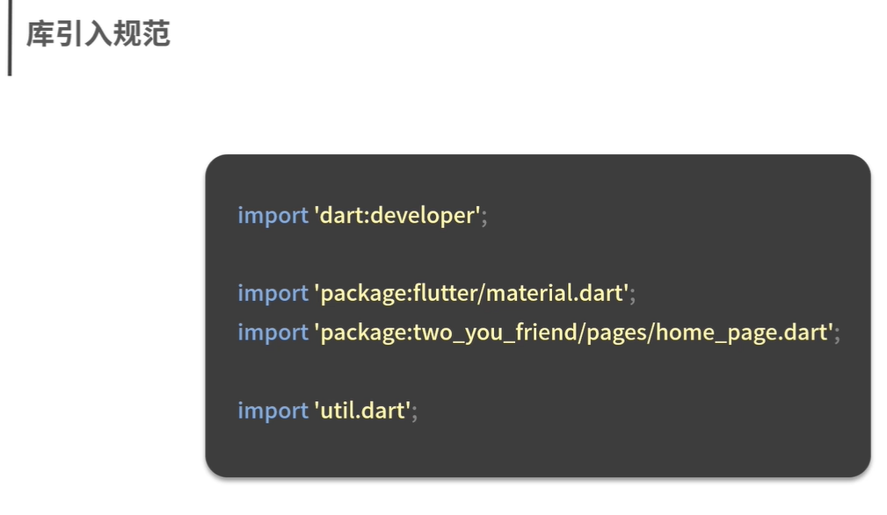

# flutter 项目

## 一、命名规则

AaBb 类规范
IsClassName

aaBb 类规范
isParameterNames，常用于常量和变量命名

aa_bb 类规范
is_a_fullter_file_name 文件或者、文件夹命名


注释：

```dart
// 单行


/// 单行 
///


    /**... */

    /*...*/

```

注释文档生成
`dartdoc`



代码美化
`dart format lib`


代码质量检查
`dart analyze lib`