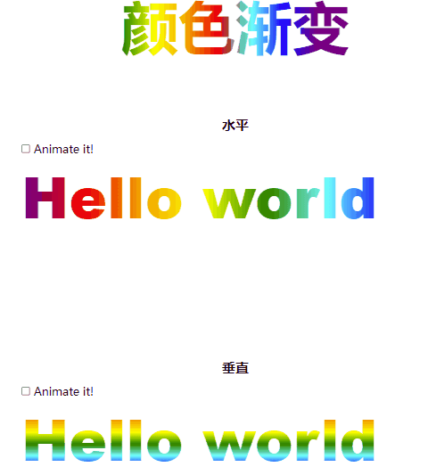
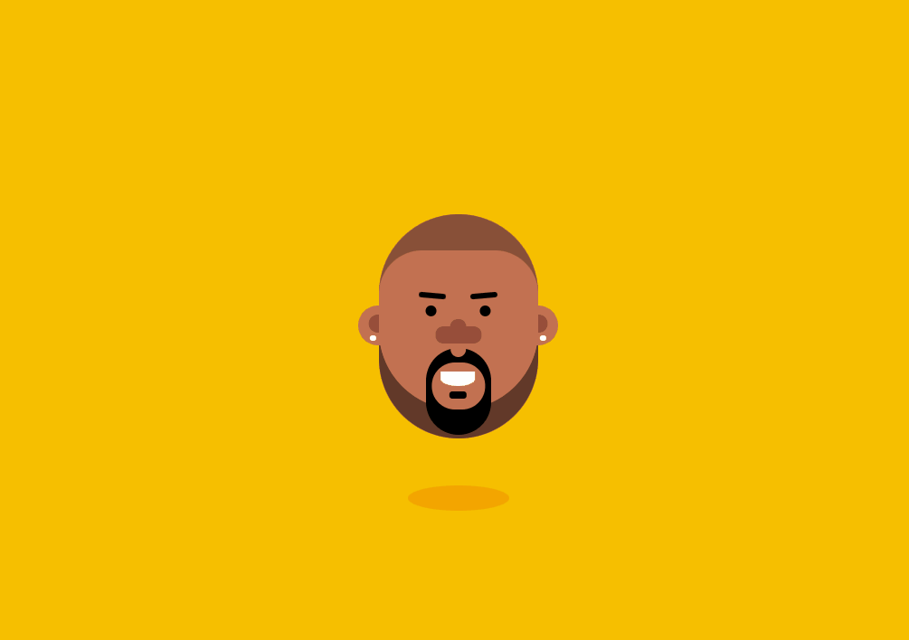
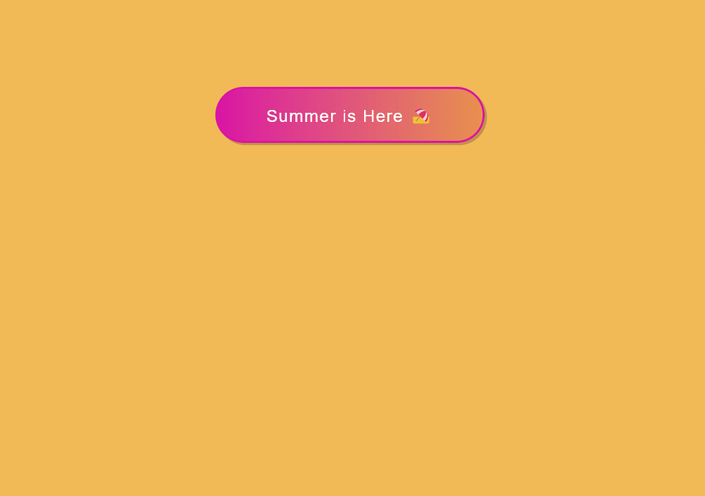
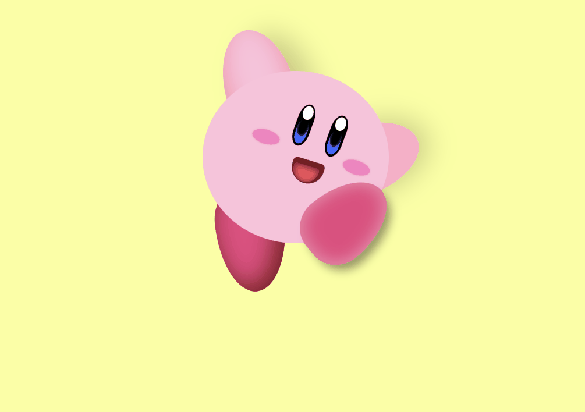
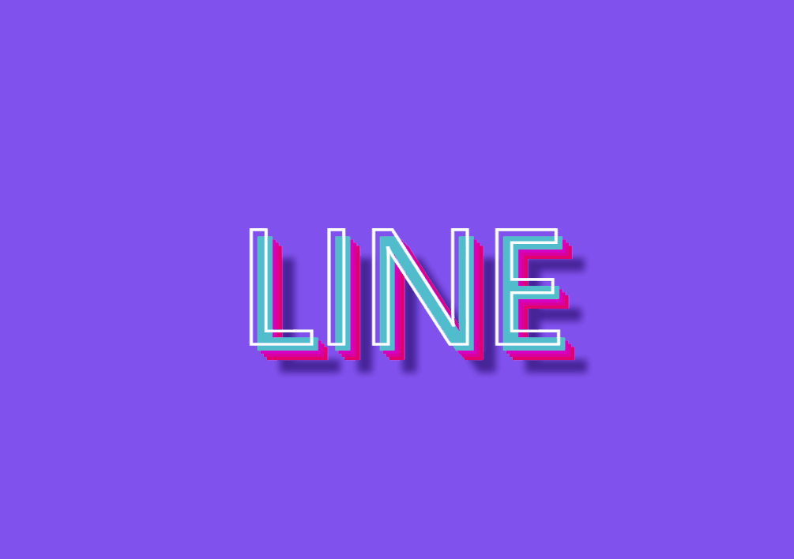
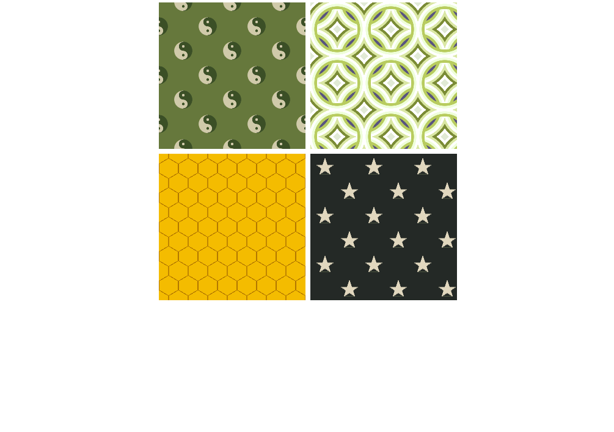
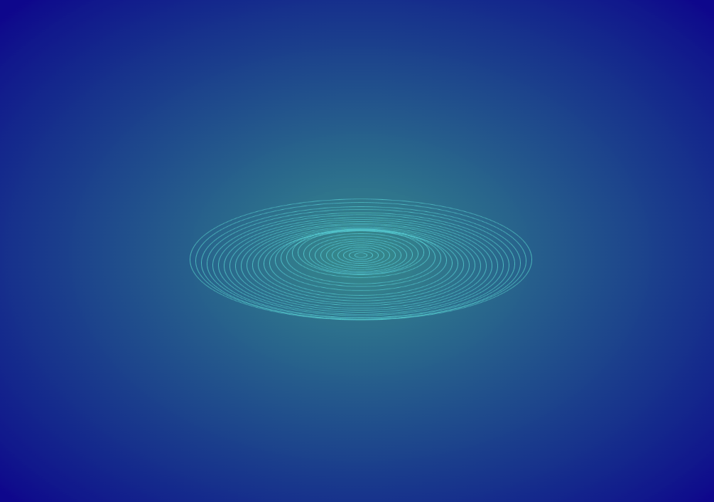
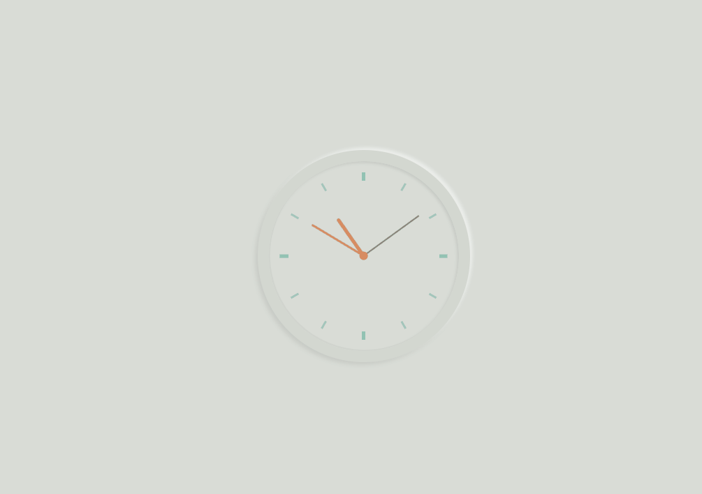
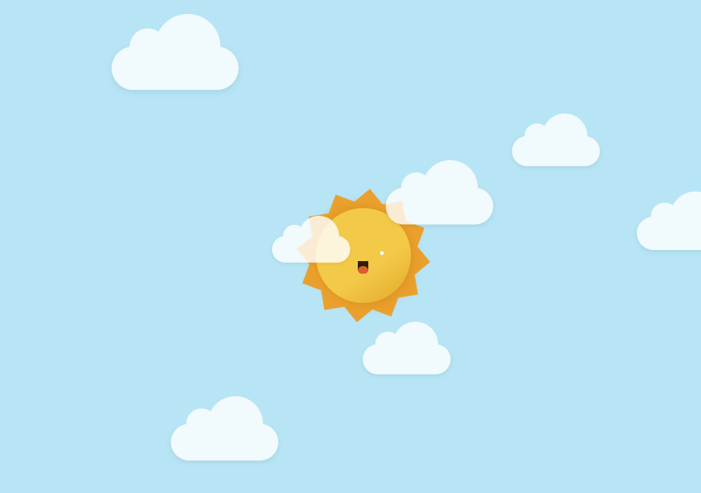
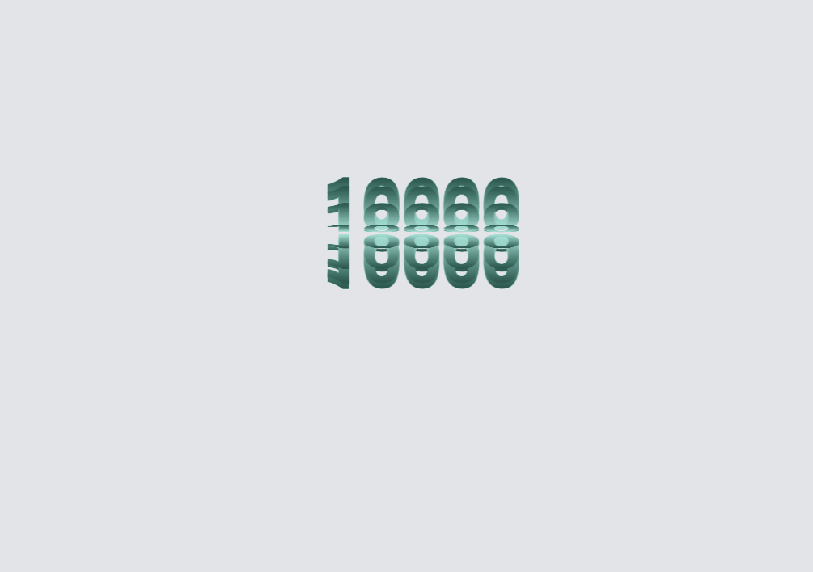

# CSS3 高阶应用  
> PS：图片看不了，试试 down 下来，就可以看到了
## 一、字体颜色滚动渐变
> 本质，背景颜色的滚动，字体颜色的透明，让人看起来以为是字体颜色在变化

## 二、给衣服换个颜色
> transform 使元素旋转：    transform: rotate(-80deg);  

  
## 三、人物移动控制
> grid 布局，css：hover 状态修改  

  

## 四、夏日按钮

## 五、CSS 实现卡通人物

## 六、立体字母  

  

## 七、CSS 实现背景图片

## 八、水波效果

## 九、炫酷轮播图

## 十、夜空

## 十一、一般的轮播图 CSS 实现
> 还有 js、Jquery 实现

## 十二、穿越时空

## 十三、时钟

## 十四、蓝天、白云、太阳

## 十五、旋转螺丝

