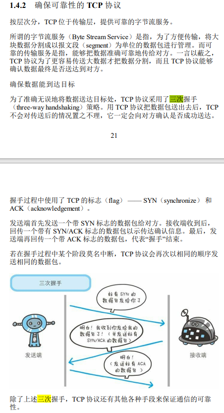
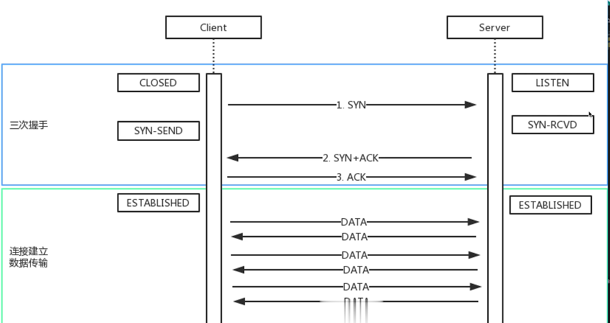

# TCP 的三次握手 和 四次挥手

握手：连接的过程

1. 先建立连接（确保双方都有收发消息的能力）
2. 再传输内容（如发送一个 GET 请求）
3. 网络连接是 TCP 协议，传输内容是 HTTP 协议

## 三次握手

- Client 发包，Server 接收
    - Server： Client 要找我
- Server 发包，Client 接收
    - Client： Server 接收了消息
- Client 发包， Server 接收
    - Server： Client 要准备发送了

## 四次挥手 —— 关闭链接

- Client 发包，Server 接收
    - Server： Client 已请求结束
- Server 发包，Client 接收
    - Client： Server 已收到，我等待它关闭
- Server 发包，Client 接收
    - Client： Server 此时可以关闭链接了
- Client 发包，Server 接收
    - Server： 可以关闭了（然后关闭连接）

握手是连接，挥手是告别

